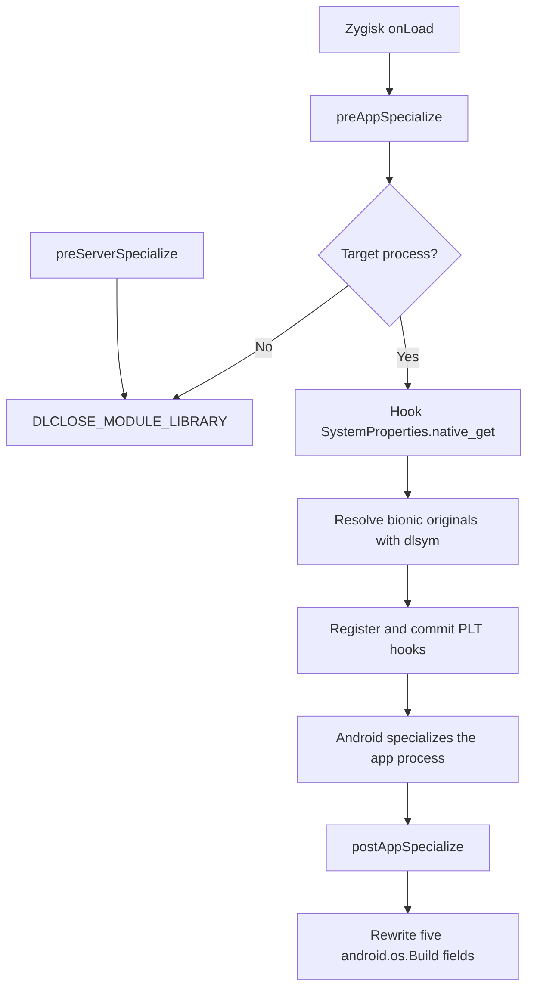

# Implementation and Maintenance Guide

[简体中文](IMPLEMENTATION.zh-CN.md)

## 1. Goals and scope

This module spoofs the product identity exposed to `com.ruanmei.ithome`. The
target is the package itself and every non-empty colon-suffixed child process,
such as `com.ruanmei.ithome:remote`; an empty suffix is not a child-process
match. No other application is in scope.

The module changes identity values only. It explicitly does not change the
Android version, build fingerprint, serial number, IMEI, Android ID, hardware
capabilities, Magisk visibility, or Play Integrity. Those are separate device,
security, or capability surfaces and are intentionally outside this project's
contract.

Android code can read product identity through three paths:

1. `android.os.Build` exposes cached static Java fields.
2. Java callers can query `android.os.SystemProperties`, whose
   `native_get(String, String)` method reaches the property service.
3. Native code can call bionic's direct `__system_property_get` or
   `__system_property_read_callback` APIs.

One interception mechanism cannot cover all three paths. Rewriting only the
`Build` fields misses later Java property reads and native callers. Hooking only
Java misses native callers, while hooking only bionic misses already-cached
`Build` fields and Java implementations that do not reach bionic. The module
therefore uses one narrowly scoped layer for each read path, all backed by the
same identity constants and property allowlist.

## 2. Zygisk lifecycle and data flow

The complete callback and hook sequence is:



`module/jni/module.cpp` is the coordinator. `onLoad` retains the Zygisk API and
JNI environment. In `preAppSpecialize`, it reads the process nice name and
asks `module/jni/lifecycle.cpp` whether this is the target. For a target, the
Java `native_get` hook is installed and the executable mappings are scanned so
the native hooks can be registered and committed before Android specializes
the app process. The target keeps the module library loaded because the target
hook callback pointers live in that library and must remain valid after
specialization. A non-target app and `system_server` install no hooks, so they
can safely request `DLCLOSE_MODULE_LIBRARY`; the non-target app does so
immediately and `preServerSpecialize` does so for `system_server`.

`postAppSpecialize` runs only for a target and writes the five `Build` fields
after specialization, when the app's Java runtime is ready. Thus Java and
native property interception are installed before specialization, while the
cached Java fields are rewritten afterward.

## 3. Three identity-coverage layers

The three mechanisms below are complementary: the `Build` writer covers cached
fields, the Java hook covers property reads from Java, and the bionic PLT hooks
cover native callers in the executable libraries visible during
specialization.

### 3.1 `android.os.Build` field writer

`module/jni/build_fields.cpp` obtains the `android/os/Build` class with
`FindClass`. For each entry in `kBuildFields`, it calls
`GetStaticFieldID` with the `Ljava/lang/String;` type, creates the replacement
with `NewStringUTF`, and writes it using `SetStaticObjectField`. The five
static strings are `MANUFACTURER`, `BRAND`, `MODEL`, `DEVICE`, and `PRODUCT`.
The writer counts attempted and successful fields and handles each field
independently, so an individual lookup or write failure does not make it write
an unrelated field through a different mechanism.

### 3.2 Java `SystemProperties.native_get` hook

The coordinator calls Zygisk's `hookJniNativeMethods` for
`android/os/SystemProperties`, replacing `native_get` with the exact signature
`(Ljava/lang/String;Ljava/lang/String;)Ljava/lang/String;`. The method pointer
returned by the hook operation is saved as the original delegate. The hook
checks the Java key against the property allowlist; a recognized key returns a
new Java string containing the mapped identity, while an unknown key, a null
key, or a failed module-side conversion delegates to the original method (or
the supplied default if no original is available).

### 3.3 Native bionic PLT hooks

Before registration, `module/jni/module.cpp` parses `/proc/self/maps` and keeps
only executable mappings. It de-duplicates mappings by device and inode so a
shared ELF is registered once even if it has multiple executable ranges.
`module/jni/module.cpp` resolves the bionic originals through
`resolve_bionic_symbol` (`dlsym(RTLD_DEFAULT, ...)`) and passes an injected
resolver and hook API to `module/jni/native_hooks.cpp`. That file invokes the
resolver, validates and publishes the original pointers, and orchestrates
registration and commit of PLT replacements for `__system_property_get` and
`__system_property_read_callback` in every retained mapping.

The direct-get replacement substitutes a recognized value in the caller's
buffer and otherwise calls the original. The read-callback replacement invokes
the original API with a wrapper callback. That wrapper preserves the original
property `name`, `serial`, and caller `cookie`, and preserves an unrelated
property's original `value`; it substitutes only an allowlisted property
value. The allowlist and suffix matching are shared with the Java hook.

## 4. Identity and property mappings

The current identity is:

| Build field | Value |
| --- | --- |
| `MANUFACTURER` | `samsung` |
| `BRAND` | `samsung` |
| `MODEL` | `SM-S9480` |
| `DEVICE` | `s26ultra` |
| `PRODUCT` | `s26ultrachn` |

The six complete property prefix groups are:

```text
ro.product.
ro.product.system.
ro.product.vendor.
ro.product.product.
ro.product.odm.
ro.product.system_ext.
```

Property suffix mappings are separate from the Build-field table: every prefix
supports `manufacturer` → `kManufacturer`, `brand` → `kBrand`, `model` →
`kModel`, `device` → `kDevice`, and `name` → `kProduct`. The `name` suffix
therefore maps to `s26ultrachn`; it is not a separate identity literal.

`module/jni/include/s26spoof/identity.hpp` is the single literal source for
`kPackageName`, `kManufacturer`, `kBrand`, `kModel`, `kDevice`, `kProduct`, and
the five `kBuildFields` entries. `module/jni/core.cpp` owns the prefix and
suffix lookup through `kPropertyPrefixes` and `kPropertyValues`; it uses exact
prefix-plus-suffix matching and returns no override for any other key.

## 5. Fail-open behavior and exception safety

Native installation resolves and publishes both bionic originals before it
registers any native hook. If either `__system_property_get` or
`__system_property_read_callback` cannot be resolved, or its `dlsym` result is
an invalid resolved original (null or equal to the replacement hook), all
native registration is disabled. If registration or
the final commit is partial or fails, calls that are unrelated to a recognized
property still delegate to the available original functions; the module does
not invent a global property value.

Recognized values are copied with a bounded capacity of `PROP_VALUE_MAX`,
including a terminating NUL. Unknown, malformed, null, or empty keys pass
through. The callback path retains the original property metadata and only
changes the allowlisted value.

JNI entry points preserve an exception that existed before the module began
its work. They clear only an exception immediately created by the module while
performing a lookup, string conversion, or field write, then take the safe
delegate/default path. A pre-existing exception is never silently claimed by
the module.

The target log reports the layers independently. `java` reports the Java hook,
`native_get` reports the direct bionic hook, and `native_read_callback` reports
the callback hook. `native=1` means both native hook statuses are ready, while
`fields=succeeded/attempted` reports the five-field writer result. This makes a
single missing layer diagnosable without implying that the other layers also
failed.

## 6. Maintenance recipes

For every recipe, keep the module target-local. Do not add `system.prop`,
`resetprop`, or other global writes. Do not add production identity
configuration literals outside `module/jni/include/s26spoof/identity.hpp`;
tests and documentation intentionally retain explicit expected values and must
be updated together.

### Change the target package

Edit `kPackageName` in `module/jni/include/s26spoof/identity.hpp`; it is the
only production matching constant. Update the
positive and negative process-name cases in
`tests/native/core_test.cpp`, then update `tests/native/lifecycle_test.cpp` so
target and non-target lifecycle actions still agree with the new package and
its colon-suffixed children. Synchronize `module/module.prop`'s description if
applicable, the metadata expectation in `scripts/verify-package.sh`,
`README.md`, and both implementation guides
(`docs/IMPLEMENTATION.md` and `docs/IMPLEMENTATION.zh-CN.md`).

### Change the spoofed identity

Edit the five constants `kManufacturer`, `kBrand`, `kModel`, `kDevice`, and
`kProduct` in `module/jni/include/s26spoof/identity.hpp`. Update
`tests/native/core_test.cpp`,
`tests/native/build_fields_test.cpp`, `tests/native/property_hooks_test.cpp`,
and `tests/native/java_property_hook_test.cpp` to assert the new values through
every read layer. Synchronize identity values in `module/module.prop`'s
description if applicable, the expected metadata in
`scripts/verify-package.sh`, `README.md`, and both implementation guides
where those values appear.

### Add or remove property aliases

Edit `kPropertyPrefixes` and/or `kPropertyValues` in `module/jni/core.cpp`.
Matching is exact: a prefix must be followed by one of the exact supported
suffixes, with no substring or fuzzy matching. Update the recognized and
rejected-key cases in `tests/native/core_test.cpp`, and keep
`tests/native/property_hooks_test.cpp`,
`tests/native/java_property_hook_test.cpp`, and
`tests/native/native_hooks_test.cpp` aligned with the resulting allowlist.

### Change the rewritten Build fields

Edit `kBuildFields` in `module/jni/include/s26spoof/identity.hpp`. If the set of
fields changes, update
`FakeJni::fields_`, field counts, and assertions in
`tests/native/build_fields_test.cpp`; also update any documentation or log
expectations that depend on the five-field contract.

### Add or remove an ABI

Edit `APP_ABI` in `module/jni/Application.mk`. Update the staging copies in
`scripts/build.sh` and the exact package entries in
`scripts/verify-package.sh`. Each shared library must be named
`zygisk/<abi>.so` in the ZIP. Keep the package's exact-entry check and the
native library export check in sync with the ABI set. If supported ABI claims
appear there, synchronize `module/module.prop` metadata if applicable,
`README.md`, and both implementation guides
(`docs/IMPLEMENTATION.md` and `docs/IMPLEMENTATION.zh-CN.md`).

## 7. Build, tests, and debugging

Run the host suites, build the module, and verify the resulting package with
these commands:

```sh
ANDROID_NDK_ROOT=/path/to/android-ndk ./scripts/test-host.sh all
ANDROID_NDK_ROOT=/path/to/android-ndk ./scripts/build.sh
ANDROID_NDK_ROOT=/path/to/android-ndk ./scripts/verify-package.sh out/s26spoof-v1.0.0.zip
```

The scripts require Android NDK r27 or newer; current verification uses NDK
r28.2 (`28.2.13676358`). `test-host.sh all` runs the core, maps, property-hook,
JNI, and lifecycle suites. The mapping from tests to production
responsibilities is:

| Test file | Production responsibility |
| --- | --- |
| `tests/native/core_test.cpp` | target-process matching, exact prefixes/suffixes, bounded copies |
| `tests/native/maps_test.cpp` | `/proc/self/maps` parsing and executable-map de-duplication |
| `tests/native/property_hooks_test.cpp` | direct-get and callback substitution/delegation |
| `tests/native/native_hooks_test.cpp` | injected fake resolver/API orchestration seams and commit fail-open behavior |
| `tests/native/build_fields_test.cpp` | five JNI field writes, counts, and exception handling |
| `tests/native/java_property_hook_test.cpp` | direct `hooked_java_property_get` behavior and Java fallback/exceptions |
| `tests/native/lifecycle_test.cpp` | target/non-target/server callback actions |

These host tests exercise injected seams, not the platform integration itself.
In particular, `tests/native/native_hooks_test.cpp` uses a fake resolver and
fake hook API, so it does not test real `dlsym` resolution or Zygisk PLT
integration. `tests/native/java_property_hook_test.cpp` directly calls
`hooked_java_property_get`; it does not validate the `native_get` name and
descriptor or `hookJniNativeMethods` installation. Actual JNI method lookup,
real bionic resolution, and Zygisk hook installation require device/runtime
verification, including the target-process log contract below.

For a target process, the expected diagnostic contract contains this exact
substring:

```text
target=1 java=1 native=1 native_get=1 native_read_callback=1 fields=5/5
```

Each zero narrows the problem to a layer: `java=0` points to JNI method-hook
installation, `native_get=0` to direct bionic registration or its delegate,
`native_read_callback=0` to callback registration or its delegate,
`native=0` means one or both native statuses are unavailable, and a fields
count below `5/5` points to Build class/field lookup, string creation, or a
field write. A missing `target=1` means process selection did not match.

When changing a mapping, run the smallest affected host suite first and then
`test-host.sh all`; after a package build, run the exact ZIP verification
command. Runtime logs should be checked in the target process, not in a
non-target app or `system_server`, because those processes intentionally
request module unload.

## 8. Known limitations and extension points

PLT registration covers executable ELF mappings that are present when the
target process is being specialized and `/proc/self/maps` is scanned. A
library loaded later, or a call path that directly bypasses the registered
PLT entry, may reach bionic without the native replacement. The Java
`native_get` hook and the `Build` rewrite still apply to their respective
paths.

Loader-level or inline hooks could broaden native coverage, but they add ABI,
stability, and ongoing maintenance risk. They are intentionally excluded from
this module. Any extension should preserve target-only scope, the shared
identity source, exact allowlist matching, and the existing fail-open behavior.
