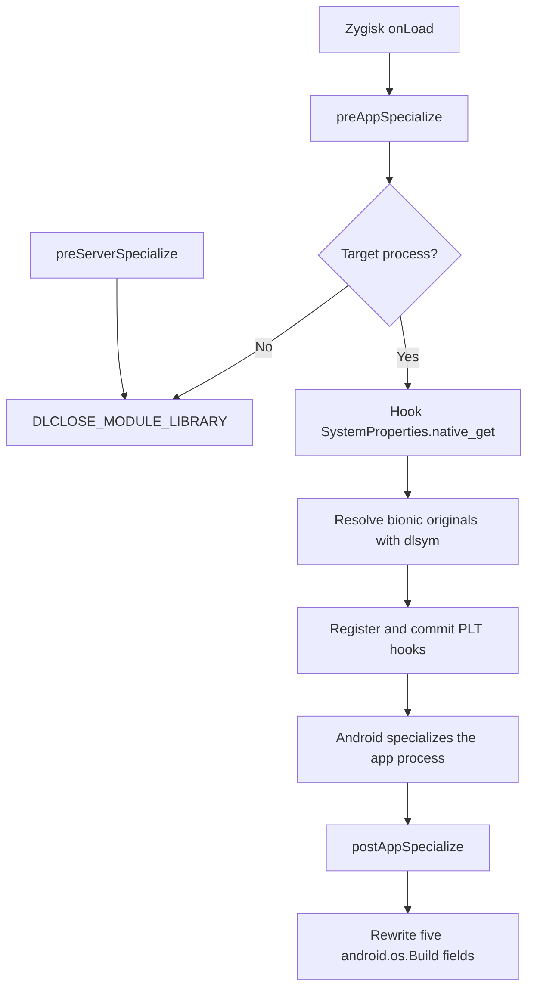

# 实现与维护指南

[English](IMPLEMENTATION.md)

## 1. 目标与范围

本模块伪装向 `com.ruanmei.ithome` 暴露的产品身份。目标包括该包本身以及每个带非空冒号后缀的子进程，例如 `com.ruanmei.ithome:remote`；空后缀不匹配子进程。其他应用不在范围内。

本模块只修改身份值。它明确不修改 Android 版本、构建指纹、序列号、IMEI、Android ID、硬件能力、Magisk 可见性或 Play Integrity。这些属于独立的设备、安全或能力层面，有意不纳入本项目契约。

Android 代码可以通过以下三条路径读取产品身份：

1. `android.os.Build` 暴露缓存的静态 Java 字段。
2. Java 调用方可以查询 `android.os.SystemProperties`，其
   `native_get(String, String)` 方法会访问属性服务。
3. Native 代码可以调用 bionic 的直接 `__system_property_get` 或
   `__system_property_read_callback` API。

单一拦截机制无法覆盖全部三条路径。只重写 `Build` 字段会遗漏后续的 Java 属性读取和 native 调用方；只 hook Java 会遗漏 native 调用方，而只 hook bionic 会遗漏已经缓存的 `Build` 字段以及不经过 bionic 的 Java 实现。因此，本模块为每条读取路径使用一个范围严格限定的层，并由同一组身份常量和属性 allowlist 提供支持。

## 2. Zygisk 生命周期与数据流

完整的回调和 hook 顺序如下：



`module/jni/module.cpp` 是协调者。`onLoad` 保留 Zygisk API 和 JNI 环境。在 `preAppSpecialize` 中，它读取进程 nice name，并询问 `module/jni/lifecycle.cpp` 当前是否为目标进程。对于目标进程，会安装 Java `native_get` hook，并扫描可执行映射，以便在 Android 对应用进程执行 specialize 之前注册并提交 native hooks。目标进程会保持模块库加载，因为目标 hook 回调指针位于该库中，在 specialize 之后仍必须有效。非目标应用和 `system_server` 都不安装 hook，因此可以安全地请求 `DLCLOSE_MODULE_LIBRARY`；非目标应用会立即请求，`preServerSpecialize` 则为 `system_server` 请求。

`postAppSpecialize` 只对目标进程执行，并在 specialize 之后、应用的 Java runtime 就绪时写入五个 `Build` 字段。因此，Java 和 native 属性拦截在 specialize 之前安装，而缓存的 Java 字段在之后重写。

## 3. 三层身份覆盖

下面三种机制彼此互补：`Build` writer 覆盖缓存字段，Java hook 覆盖来自 Java 的属性读取，bionic PLT hooks 覆盖 specialize 期间可见的可执行库中的 native 调用方。

### 3.1 `android.os.Build` 字段 writer

`module/jni/build_fields.cpp` 使用 `FindClass` 获取 `android/os/Build` 类。对于 `kBuildFields` 中的每个条目，它以 `Ljava/lang/String;` 类型调用 `GetStaticFieldID`，使用 `NewStringUTF` 创建替换字符串，并用 `SetStaticObjectField` 写入。五个静态字符串是 `MANUFACTURER`、`BRAND`、`MODEL`、`DEVICE` 和 `PRODUCT`。writer 统计尝试字段数和成功字段数，并独立处理每个字段，因此单个查找或写入失败不会导致它通过其他机制写入无关字段。

### 3.2 Java `SystemProperties.native_get` hook

协调者调用 Zygisk 的 `hookJniNativeMethods`，针对 `android/os/SystemProperties`，用精确签名 `(Ljava/lang/String;Ljava/lang/String;)Ljava/lang/String;` 替换 `native_get`。hook 操作返回的方法指针会保存为原始 delegate。该 hook 根据属性 allowlist 检查 Java key；已识别的 key 返回包含映射身份的新 Java 字符串，而未知 key、null key 或模块侧转换失败时，则 delegate 到原始方法（如果没有原始方法，则使用传入的 default）。

### 3.3 Native bionic PLT hooks

注册前，`module/jni/module.cpp` 解析 `/proc/self/maps`，只保留可执行映射。它按 device 和 inode 对映射去重，因此同一个共享 ELF 即使有多个可执行范围也只注册一次。`module/jni/module.cpp` 通过 `resolve_bionic_symbol`（`dlsym(RTLD_DEFAULT, ...)`）解析 bionic 原始函数，并将注入的 resolver 和 hook API 传给 `module/jni/native_hooks.cpp`。该文件调用 resolver，校验并发布原始指针，然后为每个保留映射中的 `__system_property_get` 和 `__system_property_read_callback` 注册并提交 PLT 替换。

direct-get replacement 会在调用方的 buffer 中替换已识别的值，否则调用原始函数。read-callback replacement 使用 wrapper callback 调用原始 API。该 wrapper 保留原始属性的 `name`、`serial` 和调用方 `cookie`，并保留无关属性的原始 `value`；它只替换 allowlist 中属性的值。allowlist 和后缀匹配逻辑与 Java hook 共享。

## 4. 身份值与属性映射

当前身份为：

| Build field | Value |
| --- | --- |
| `MANUFACTURER` | `samsung` |
| `BRAND` | `samsung` |
| `MODEL` | `SM-S9480` |
| `DEVICE` | `s26ultra` |
| `PRODUCT` | `s26ultrachn` |

六组完整的属性前缀为：

```text
ro.product.
ro.product.system.
ro.product.vendor.
ro.product.product.
ro.product.odm.
ro.product.system_ext.
```

属性后缀映射与 Build-field 表分开：每个前缀都支持 `manufacturer` → `kManufacturer`、`brand` → `kBrand`、`model` → `kModel`、`device` → `kDevice` 以及 `name` → `kProduct`。因此，`name` 后缀映射到 `s26ultrachn`；它不是独立的身份字面量。

`module/jni/include/s26spoof/identity.hpp` 是 `kPackageName`、`kManufacturer`、`kBrand`、`kModel`、`kDevice`、`kProduct` 以及五个 `kBuildFields` 条目的唯一字面量来源。`module/jni/core.cpp` 通过 `kPropertyPrefixes` 和 `kPropertyValues` 负责前缀和后缀查找；它使用精确的前缀加后缀匹配，对任何其他 key 都不返回 override。

## 5. Fail-open 与异常安全

Native 安装会在注册任何 native hook 之前解析并发布两个 bionic 原始函数。如果无法解析 `__system_property_get` 或 `__system_property_read_callback` 中的任一个，或者其 `dlsym` 结果是无效的已解析原始函数（null 或等于 replacement hook），则禁用所有 native 注册。如果注册或最终 commit 部分完成或失败，与已识别属性无关的调用仍会 delegate 到可用的原始函数；模块不会凭空创建全局属性值。

已识别的值使用 `PROP_VALUE_MAX` 的有界容量进行复制，其中包括结尾的 NUL。未知、格式错误、null 或空 key 都会透传。callback 路径保留原始属性元数据，只修改 allowlist 中的值。

JNI 入口点会保留模块开始工作之前已经存在的异常。它们只清除模块在执行查找、字符串转换或字段写入时刚刚创建的异常，然后走安全 delegate/default 路径。预先存在的异常绝不会被模块悄然接管。

目标日志分别报告各层状态。`java` 报告 Java hook，`native_get` 报告直接 bionic hook，`native_read_callback` 报告 callback hook。`native=1` 表示两个 native hook 状态都已就绪，而 `fields=succeeded/attempted` 报告五字段 writer 的结果。这样可以诊断单个缺失层，而不会暗示其他层也失败。

## 6. 二次修改指南

对于每个修改配方，都要保持模块仅作用于目标。不要添加 `system.prop`、`resetprop` 或其他全局写入。不要在 `module/jni/include/s26spoof/identity.hpp` 之外添加生产身份配置字面量；测试和文档会有意保留明确的预期值，必须同步更新。

### 6.1 更换目标包名

编辑 `module/jni/include/s26spoof/identity.hpp` 中的 `kPackageName`；它是唯一的生产匹配常量。更新 `tests/native/core_test.cpp` 中的正面和负面进程名用例，然后更新 `tests/native/lifecycle_test.cpp`，确保目标和非目标生命周期操作仍与新包名及其冒号后缀子进程一致。视情况同步 `module/module.prop` 的 description、`scripts/verify-package.sh` 中的 metadata 预期值、`README.md` 以及两份实现指南（`docs/IMPLEMENTATION.md` 和 `docs/IMPLEMENTATION.zh-CN.md`）。

### 6.2 修改伪装身份

编辑 `module/jni/include/s26spoof/identity.hpp` 中的五个常量 `kManufacturer`、`kBrand`、`kModel`、`kDevice` 和 `kProduct`。更新 `tests/native/core_test.cpp`、`tests/native/build_fields_test.cpp`、`tests/native/property_hooks_test.cpp` 和 `tests/native/java_property_hook_test.cpp`，使其通过每个读取层断言新值。视情况同步 `module/module.prop` description 中的身份值、`scripts/verify-package.sh` 中的预期 metadata、`README.md` 以及两份实现指南中出现这些值的地方。

### 6.3 调整属性别名

编辑 `module/jni/core.cpp` 中的 `kPropertyPrefixes` 和/或 `kPropertyValues`。匹配是精确的：前缀后必须紧接某个精确支持的后缀，不允许子串或模糊匹配。更新 `tests/native/core_test.cpp` 中识别 key 和拒绝 key 的用例，并让 `tests/native/property_hooks_test.cpp`、`tests/native/java_property_hook_test.cpp` 和 `tests/native/native_hooks_test.cpp` 与最终 allowlist 保持一致。

### 6.4 调整 Build 字段

编辑 `module/jni/include/s26spoof/identity.hpp` 中的 `kBuildFields`。如果字段集合发生变化，更新 `tests/native/build_fields_test.cpp` 中的 `FakeJni::fields_`、字段计数和断言；同时更新依赖五字段契约的任何文档或日志预期。

### 6.5 调整 ABI

编辑 `module/jni/Application.mk` 中的 `APP_ABI`。更新 `scripts/build.sh` 中的 staging 副本以及 `scripts/verify-package.sh` 中的精确包条目。ZIP 中每个共享库都必须命名为 `zygisk/<abi>.so`。保持包的精确条目检查和 native library export 检查与 ABI 集合同步。如果其中出现支持的 ABI 声明，视情况同步 `module/module.prop` metadata、`README.md` 以及两份实现指南（`docs/IMPLEMENTATION.md` 和 `docs/IMPLEMENTATION.zh-CN.md`）。

## 7. 构建/测试/调试

运行 host 测试套件、构建模块，并用以下命令验证生成的包：

```sh
ANDROID_NDK_ROOT=/path/to/android-ndk ./scripts/test-host.sh all
ANDROID_NDK_ROOT=/path/to/android-ndk ./scripts/build.sh
ANDROID_NDK_ROOT=/path/to/android-ndk ./scripts/verify-package.sh out/s26spoof-v1.0.0.zip
```

脚本要求 Android NDK r27 或更高版本；当前验证使用 NDK r28.2（`28.2.13676358`）。`test-host.sh all` 会运行 core、maps、property-hook、JNI 和 lifecycle 套件。测试与生产职责的对应关系如下：

| Test file | Production responsibility |
| --- | --- |
| `tests/native/core_test.cpp` | 目标进程匹配、精确前缀/后缀、有界复制 |
| `tests/native/maps_test.cpp` | `/proc/self/maps` 解析和可执行映射去重 |
| `tests/native/property_hooks_test.cpp` | direct-get 和 callback 的替换/委托 |
| `tests/native/native_hooks_test.cpp` | 注入的 fake resolver/API 编排 seam 以及 commit fail-open 行为 |
| `tests/native/build_fields_test.cpp` | 五次 JNI 字段写入、计数和异常处理 |
| `tests/native/java_property_hook_test.cpp` | `hooked_java_property_get` 的直接行为以及 Java fallback/异常 |
| `tests/native/lifecycle_test.cpp` | 目标/非目标/server 回调操作 |

这些 host 测试使用注入的 seam，而不是平台集成本身。特别是，`tests/native/native_hooks_test.cpp` 使用 fake resolver 和 fake hook API，因此不测试真实的 `dlsym` 解析或 Zygisk PLT 集成。`tests/native/java_property_hook_test.cpp` 直接调用 `hooked_java_property_get`；它不验证 `native_get` 名称和 descriptor，也不验证 `hookJniNativeMethods` 安装。实际 JNI method lookup、真实 bionic resolution 和 Zygisk hook 安装必须通过 device/runtime 验证，包括下面的目标进程日志契约。

对目标进程，预期诊断契约包含以下精确子串：

```text
target=1 java=1 native=1 native_get=1 native_read_callback=1 fields=5/5
```

每个零值都会将问题范围缩小到某一层：`java=0` 指向 JNI method-hook 安装，`native_get=0` 指向直接 bionic 注册或其 delegate，`native_read_callback=0` 指向 callback 注册或其 delegate，`native=0` 表示一个或两个 native 状态不可用，而低于 `5/5` 的 fields 计数指向 Build 类/字段查找、字符串创建或字段写入。缺少 `target=1` 表示进程选择未匹配。

修改映射时，先运行受影响范围最小的 host 套件，然后运行 `test-host.sh all`；完成包构建后，运行精确的 ZIP 验证命令。应在目标进程中检查 runtime 日志，而不是在非目标应用或 `system_server` 中检查，因为这些进程会有意请求模块卸载。

## 8. 已知限制/扩展点

PLT 注册覆盖目标进程 specialize 和扫描 `/proc/self/maps` 时已经存在的可执行 ELF 映射。之后才加载的库，或直接绕过已注册 PLT entry 的调用路径，可能不经过 native replacement 而直接到达 bionic。Java `native_get` hook 和 `Build` rewrite 仍分别作用于各自路径。

Loader 层或 inline hooks 可以扩大 native 覆盖范围，但会增加 ABI、稳定性和持续维护风险。本模块有意排除这些机制。任何扩展都应保持仅作用于目标、共享身份源、精确 allowlist 匹配以及现有的 fail-open 行为。
