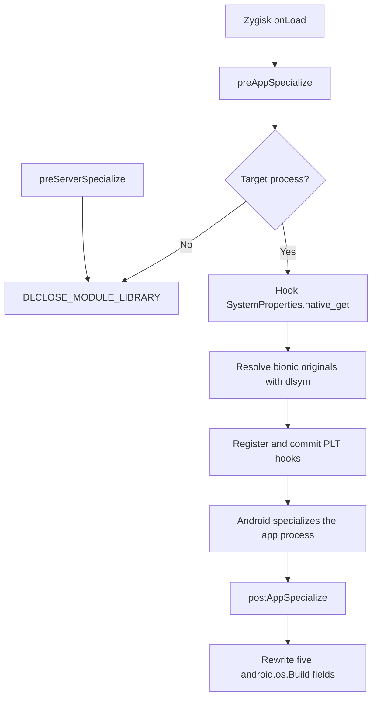

# Bilingual Implementation Guides Implementation Plan

> **For agentic workers:** REQUIRED SUB-SKILL: Use superpowers:subagent-driven-development (recommended) or superpowers:executing-plans to implement this plan task-by-task. Steps use checkbox (`- [ ]`) syntax for tracking.

**Goal:** Publish equivalent English and Simplified Chinese developer guides that explain the current three-layer Zygisk implementation and give safe, concrete maintenance recipes.

**Architecture:** Keep the public maintenance material in two focused files under `docs/`, with English as the default and Chinese as a complete peer translation. Keep README concise by adding only language links. Validate both guides against current source symbols, commands, headings, and file paths without changing production code.

**Tech Stack:** GitHub-Flavored Markdown, Mermaid, POSIX shell validation, existing C++17/NDK project files.

---

### Task 1: English implementation and maintenance guide

**Files:**
- Create: `docs/IMPLEMENTATION.md`
- Reference: `docs/superpowers/specs/2026-08-07-implementation-docs-design.md`
- Reference: `module/jni/module.cpp`
- Reference: `module/jni/build_fields.cpp`
- Reference: `module/jni/property_hooks.cpp`
- Reference: `module/jni/native_hooks.cpp`
- Reference: `module/jni/core.cpp`
- Reference: `module/jni/include/s26spoof/identity.hpp`
- Test: shell content checks against `docs/IMPLEMENTATION.md`

- [ ] **Step 1: Verify the English guide is absent**

Run:

```bash
test -f docs/IMPLEMENTATION.md
```

Expected: exit status 1 because the guide has not been created.

- [ ] **Step 2: Write the complete English guide**

Create `docs/IMPLEMENTATION.md` with this exact top-level structure:

```markdown
# Implementation and Maintenance Guide

[简体中文](IMPLEMENTATION.zh-CN.md)

## 1. Goals and scope
## 2. Zygisk lifecycle and data flow
## 3. Three identity-coverage layers
## 4. Identity and property mappings
## 5. Fail-open behavior and exception safety
## 6. Maintenance recipes
## 7. Build, tests, and debugging
## 8. Known limitations and extension points
```

The guide must include the following complete technical content.

Under section 1:

- State that only `com.ruanmei.ithome` and non-empty colon-suffixed child
  processes are targets.
- State that Android version, fingerprint, serial, IMEI, Android ID, hardware
  capabilities, Magisk visibility, and Play Integrity are outside scope.
- Explain why one interception mechanism is insufficient: callers may read
  `android.os.Build`, Java `SystemProperties`, or bionic directly.

Under section 2, include this Mermaid diagram and explain each callback:



The prose must identify `module/jni/module.cpp` as the coordinator, explain
that target hooks are installed before specialization, explain that Build
fields are written after specialization, and explain why target processes keep
the module loaded while non-target and system-server paths request unload.

Under section 3, create three subsections:

```markdown
### 3.1 `android.os.Build` field writer
### 3.2 Java `SystemProperties.native_get` hook
### 3.3 Native bionic PLT hooks
```

Document these exact implementation facts:

- `build_fields.cpp` uses `FindClass`, `GetStaticFieldID`,
  `NewStringUTF`, and `SetStaticObjectField` for five static strings.
- `hookJniNativeMethods` replaces `native_get` with signature
  `(Ljava/lang/String;Ljava/lang/String;)Ljava/lang/String;` and retains the
  returned original for unrelated keys.
- `module.cpp` parses `/proc/self/maps` and de-duplicates executable mappings by
  device/inode before `native_hooks.cpp` registers
  `__system_property_get` and `__system_property_read_callback`.
- The callback wrapper preserves property name, serial, cookie, and unrelated
  value while substituting only allowlisted identity keys.

Under section 4, include this field table:

```markdown
| Build field | Value |
|---|---|
| `MANUFACTURER` | `samsung` |
| `BRAND` | `samsung` |
| `MODEL` | `SM-S9480` |
| `DEVICE` | `s26ultra` |
| `PRODUCT` | `s26ultrachn` |
```

List all six property prefix families:

```text
ro.product.
ro.product.system.
ro.product.vendor.
ro.product.product.
ro.product.odm.
ro.product.system_ext.
```

Explain that each supports `manufacturer`, `brand`, `model`, `device`, and
`name`; `name` maps to `kProduct`. Explain that `identity.hpp` is the single
source for the five literal values, while `core.cpp` owns prefix/suffix lookup.

Under section 5, document:

- Both bionic originals are resolved and published before any PLT registration.
- Missing either original disables native hook registration completely.
- A partial or failed commit can still delegate unrelated calls to the
  pre-published implementations.
- Recognized values are bounded to `PROP_VALUE_MAX`; unknown keys pass through.
- JNI work preserves an exception already pending on entry and clears only a
  failure created by the module's own immediate JNI operation.
- Hook status is logged independently as `java`, `native_get`,
  `native_read_callback`, and `fields=succeeded/attempted`.

Under section 6, include five concrete recipes:

1. **Change the target package:** edit only `kPackageName` in
   `identity.hpp`, then update positive and negative package cases in
   `tests/native/core_test.cpp` and lifecycle cases in
   `tests/native/lifecycle_test.cpp`.
2. **Change the spoofed identity:** edit `kManufacturer`, `kBrand`, `kModel`,
   `kDevice`, and `kProduct` in `identity.hpp`; update expectations in
   `core_test.cpp`, `build_fields_test.cpp`, `property_hooks_test.cpp`, and
   `java_property_hook_test.cpp`.
3. **Change property aliases:** edit `kPropertyPrefixes` or `kPropertyValues`
   in `core.cpp`; preserve exact-match behavior and update both recognized and
   rejection cases in `core_test.cpp`.
4. **Change Build fields:** edit `kBuildFields` in `identity.hpp`; if the field
   set changes, update `FakeJni::fields_`, attempted/succeeded counts, and field
   assertions in `build_fields_test.cpp`.
5. **Change ABIs:** edit `APP_ABI` in `Application.mk`, then update staging and
   exact-entry checks in `build.sh` and `verify-package.sh`. Explain that Zygisk
   library names must be `zygisk/<abi>.so` in the ZIP.

Each recipe must warn against adding `system.prop`, `resetprop`, global writes,
or identity literals outside `identity.hpp`.

Under section 7, include these commands exactly:

```bash
ANDROID_NDK_ROOT=/path/to/android-ndk ./scripts/test-host.sh all
ANDROID_NDK_ROOT=/path/to/android-ndk ./scripts/build.sh
ANDROID_NDK_ROOT=/path/to/android-ndk ./scripts/verify-package.sh out/s26spoof-v1.0.0.zip
```

Explain the successful log contract:

```text
target=1 java=1 native=1 native_get=1 native_read_callback=1 fields=5/5
```

Describe how a zero in each status narrows the fault to JNI native-method
lookup, one of the bionic PLT hooks, or Build-field reflection. Link test files
to their production responsibility and state that both NDK r27 and r28.2 are
supported by current verification.

Under section 8, explain that PLT registration covers only executable ELFs
already mapped during specialization. Late-loaded libraries that call bionic
directly can bypass this native layer, while Build and Java layers still apply.
State that loader hooks or inline hooks would broaden coverage but add ABI,
stability, and maintenance risk and are intentionally not implemented.

- [ ] **Step 3: Verify required English content**

Run each command separately:

```bash
test -f docs/IMPLEMENTATION.md
rg -n '^## [1-8]\.' docs/IMPLEMENTATION.md
rg -n 'preAppSpecialize|preServerSpecialize|postAppSpecialize' docs/IMPLEMENTATION.md
rg -n '__system_property_get|__system_property_read_callback' docs/IMPLEMENTATION.md
rg -n 'kPackageName|kManufacturer|APP_ABI' docs/IMPLEMENTATION.md
```

Expected: the file exists; exactly eight numbered section headings appear; all
listed lifecycle symbols, native symbols, and customization anchors are found.

- [ ] **Step 4: Commit the English guide**

```bash
git add docs/IMPLEMENTATION.md
git commit -m "docs: add English implementation guide"
```

### Task 2: Simplified Chinese implementation and maintenance guide

**Files:**
- Create: `docs/IMPLEMENTATION.zh-CN.md`
- Reference: `docs/IMPLEMENTATION.md`
- Test: shell parity checks across both guide files

- [ ] **Step 1: Verify the Chinese guide is absent**

Run:

```bash
test -f docs/IMPLEMENTATION.zh-CN.md
```

Expected: exit status 1 because the guide has not been created.

- [ ] **Step 2: Write the equivalent Chinese guide**

Create `docs/IMPLEMENTATION.zh-CN.md` with this exact top-level structure:

```markdown
# 实现与维护指南

[English](IMPLEMENTATION.md)

## 1. 目标与范围
## 2. Zygisk 生命周期与数据流
## 3. 三层身份覆盖
## 4. 身份值与属性映射
## 5. Fail-open 与异常安全
## 6. 二次修改指南
## 7. 构建、测试与调试
## 8. 已知限制与扩展点
```

Translate every technical requirement from Task 1 without omitting or changing
any code symbol, file path, command, identity value, property prefix, Mermaid
node, safety constraint, recipe step, log field, test responsibility, or known
limitation. Use natural Simplified Chinese for explanations, retain English
API/symbol names in backticks, and reuse the same Mermaid topology, tables, and
code blocks.

The five recipe titles must be:

```markdown
### 6.1 更换目标包名
### 6.2 修改伪装身份
### 6.3 调整属性别名
### 6.4 调整 Build 字段
### 6.5 调整 ABI
```

The safety language must explicitly distinguish pre-existing JNI exceptions
from exceptions created by the module itself, and must state that missing either
bionic delegate prevents all native hook registration.

- [ ] **Step 3: Verify Chinese content and structural parity**

Run each command separately:

```bash
test -f docs/IMPLEMENTATION.zh-CN.md
awk '/^## [1-8]\./ { count++ } END { exit(count == 8 ? 0 : 1) }' docs/IMPLEMENTATION.md
awk '/^## [1-8]\./ { count++ } END { exit(count == 8 ? 0 : 1) }' docs/IMPLEMENTATION.zh-CN.md
rg -n 'preAppSpecialize|preServerSpecialize|postAppSpecialize' docs/IMPLEMENTATION.zh-CN.md
rg -n '__system_property_get|__system_property_read_callback' docs/IMPLEMENTATION.zh-CN.md
rg -n 'kPackageName|kManufacturer|APP_ABI' docs/IMPLEMENTATION.zh-CN.md
```

Expected: both heading-count checks exit 0, and all shared technical anchors are
present in the Chinese guide.

- [ ] **Step 4: Commit the Chinese guide**

```bash
git add docs/IMPLEMENTATION.zh-CN.md
git commit -m "docs: add Chinese implementation guide"
```

### Task 3: README navigation and final documentation validation

**Files:**
- Modify: `README.md`
- Test: `README.md`, both implementation guides, current source tree

- [ ] **Step 1: Verify README does not yet link the guides**

Run:

```bash
rg -n 'docs/IMPLEMENTATION\.md|docs/IMPLEMENTATION\.zh-CN\.md' README.md
```

Expected: exit status 1 because neither link exists.

- [ ] **Step 2: Add the bilingual navigation section**

Insert this section immediately after the opening project description and
before `## 修改内容`:

```markdown
## 实现与维护文档

面向开发者的架构说明、源码导航和二次修改指南：

- [English implementation guide](docs/IMPLEMENTATION.md)
- [中文实现与维护指南](docs/IMPLEMENTATION.zh-CN.md)
```

- [ ] **Step 3: Verify links, paths, commands, and log fields**

Run each command separately:

```bash
test -f docs/IMPLEMENTATION.md
test -f docs/IMPLEMENTATION.zh-CN.md
test -f module/jni/module.cpp
test -f module/jni/build_fields.cpp
test -f module/jni/property_hooks.cpp
test -f module/jni/native_hooks.cpp
test -f module/jni/core.cpp
test -f module/jni/lifecycle.cpp
test -f module/jni/include/s26spoof/identity.hpp
rg -n 'docs/IMPLEMENTATION\.md' README.md
rg -n 'docs/IMPLEMENTATION\.zh-CN\.md' README.md
rg -n 'native_get=1 native_read_callback=1 fields=5/5' README.md docs/IMPLEMENTATION.md docs/IMPLEMENTATION.zh-CN.md
rg -n 'scripts/test-host\.sh all|scripts/build\.sh|scripts/verify-package\.sh' docs/IMPLEMENTATION.md docs/IMPLEMENTATION.zh-CN.md
```

Expected: every file check exits 0 and every link, log contract, and command is
found in the intended documents.

- [ ] **Step 4: Scan for unfinished content and formatting errors**

Run:

```bash
rg -n 'T[B]D|T[O]DO|FIXM[E]|fill in|待补充|稍后补充' README.md docs/IMPLEMENTATION.md docs/IMPLEMENTATION.zh-CN.md
```

Expected: exit status 1 because no unfinished marker exists.

Run:

```bash
git diff --check
```

Expected: exit status 0 with no output.

- [ ] **Step 5: Run the existing host regression suite**

Run:

```bash
ANDROID_NDK_ROOT=/Users/dijkstra/Library/Android/sdk/ndk/28.2.13676358 ./scripts/test-host.sh all
```

Expected: all seven host tests report `PASS`.

- [ ] **Step 6: Commit README navigation**

```bash
git add README.md
git commit -m "docs: link bilingual implementation guides"
```

### Task 4: Final scope and repository audit

**Files:**
- Verify: `README.md`
- Verify: `docs/IMPLEMENTATION.md`
- Verify: `docs/IMPLEMENTATION.zh-CN.md`
- Preserve: `.DS_Store` as an unrelated untracked user file

- [ ] **Step 1: Confirm only documentation files changed across the three implementation commits**

Run:

```bash
git diff --name-only HEAD~3..HEAD
```

Expected output contains exactly:

```text
README.md
docs/IMPLEMENTATION.md
docs/IMPLEMENTATION.zh-CN.md
```

- [ ] **Step 2: Confirm the branch is internally clean**

Run:

```bash
git status --short --branch
```

Expected: no tracked modification is present. The pre-existing untracked
`.DS_Store` may remain and must not be staged, modified, or deleted.

- [ ] **Step 3: Review the rendered Markdown structure**

Inspect both guides and confirm:

- Each has one H1 and eight numbered H2 sections.
- Language navigation links are reciprocal.
- Mermaid fences are closed.
- Tables have headers and separator rows.
- Code fences around commands and logs are closed.
- English and Chinese versions contain the same field values, six property
  prefixes, five recipes, three build commands, and known limitation.

No commit is required unless this audit finds a documentation defect. If it
does, fix only the affected documentation file, rerun Task 3 Steps 3-5, and
commit with:

```bash
git add README.md docs/IMPLEMENTATION.md docs/IMPLEMENTATION.zh-CN.md
git commit -m "docs: correct implementation guide parity"
```
