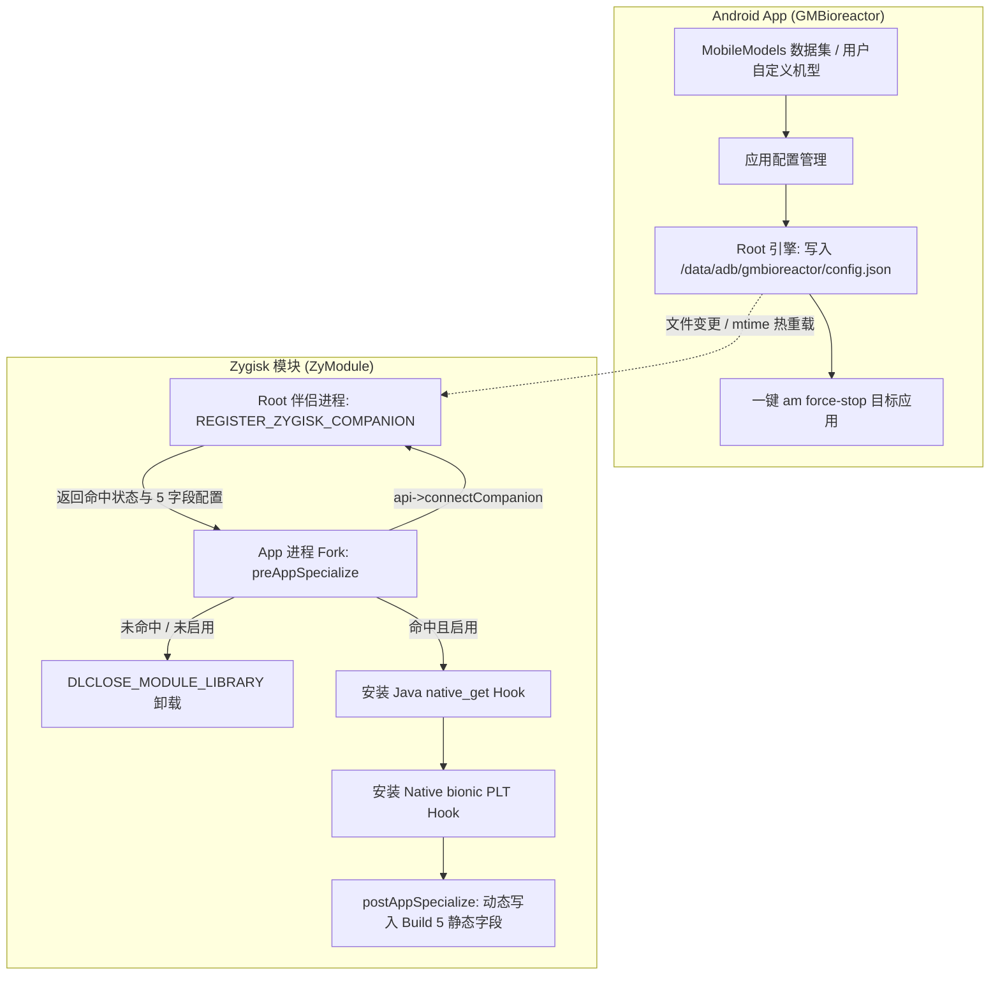

# Zygisk 动态机型伪装系统与控制 App (GMBioreactor) 架构设计规范

## 1. 目标与背景

本项目旨在构建一个完整的 Android 设备型号伪装系统，包含：
1. **Zygisk 模块 (`ZyModule`)**：在 Android 系统底层拦截目标进程的产品身份读取（`Build` 静态字段、Java `SystemProperties` 以及 Native bionic PLT），支持根据目标 App 的包名动态注入对应的 5 项核心机型标识。
2. **控制端 App (`GMBioreactor`)**：基于 Jetpack Compose + Navigation 3 构建的 Android App，集成 `MobileModels` 机型数据库，支持为不同目标 App 独立配置不同机型，并通过 Root 权限向 Zygisk 模块同步配置并即时生效。

---

## 2. 核心架构与数据流



---

## 3. 数据契约与 IPC 通信规范

### 3.1 配置文件规范
* **路径**：`/data/adb/gmbioreactor/config.json`
* **所有者与权限**：`root:root`，权限 `0644`
* **JSON 结构**：
```json
{
  "version": 1,
  "packages": {
    "com.ruanmei.ithome": {
      "enabled": true,
      "name": "Samsung Galaxy S26 Ultra",
      "manufacturer": "samsung",
      "brand": "samsung",
      "model": "SM-S9480",
      "device": "s26ultra",
      "product": "s26ultrachn"
    },
    "com.primatelabs.geekbench6": {
      "enabled": true,
      "name": "Xiaomi 15 Pro",
      "manufacturer": "Xiaomi",
      "brand": "Xiaomi",
      "model": "24129PN74C",
      "device": "haotian",
      "product": "haotian"
    }
  }
}
```

### 3.2 Zygisk Companion Socket 通信协议
* **通信通道**：`api->connectCompanion()` 获取的 Unix Domain Socket。
* **请求载荷**：
  * `uint32_t name_len`
  * `char process_name[name_len]`
* **响应载荷**：
  * `uint8_t status`：`0` 表示未命中/未启用；`1` 表示命中。
  * 若 `status == 1`，紧跟 5 个定长或 null 结尾字符串：
    * `char manufacturer[64]`
    * `char brand[64]`
    * `char model[64]`
    * `char device[64]`
    * `char product[64]`

---

## 4. Zygisk 模块 (`ZyModule`) 重构规范

### 4.1 核心组件划分
1. **`companion.cpp` (Root 伴侣守护进程)**：
   * 注册 `REGISTER_ZYGISK_COMPANION`。
   * 维护内存中配置缓存 `std::unordered_map<std::string, DeviceProfile>`。
   * 通过 `stat()` 监听 `/data/adb/gmbioreactor/config.json` 的 `mtime`，变更时重新加载。
   * 处理 socket 查询请求，支持主包名与冒号子进程（`pkg:*`）前缀匹配。
2. **`module.cpp` (Zygisk 模块入口与协调者)**：
   * `preAppSpecialize`：调用 `connectCompanion()` 获取该进程专属的 `DeviceProfile`。
   * 若未命中：设置 `DLCLOSE_MODULE_LIBRARY` 并立即返回。
   * 若命中：保存动态 profile，注册 Java `SystemProperties.native_get` Hook 与 Native PLT Hook。
   * `preServerSpecialize`：设置 `DLCLOSE_MODULE_LIBRARY`。
   * `postAppSpecialize`：通过 JNI 动态写入 5 个 `Build` 字段，并输出诊断 logcat。
3. **`core.cpp` / `property_hooks.cpp` / `build_fields.cpp`**：
   * 移除编译期静态常量绑定，改为动态接收当前进程专用的 `DeviceProfile`。
   * 支持以下 6 组属性前缀：
     * `ro.product.`
     * `ro.product.system.`
     * `ro.product.vendor.`
     * `ro.product.product.`
     * `ro.product.odm.`
     * `ro.product.system_ext.`
   * 分别对应 5 种后缀：`manufacturer`、`brand`、`model`、`device`、`name` (对应 product)。

---

## 5. Android App (`GMBioreactor`) 架构与 UI 规范

### 5.1 技术选型
* **UI 框架**：Jetpack Compose + Material 3
* **导航系统**：Navigation 3 声明式导航
* **架构模式**：MVVM (ViewModel, Repository, StateFlow)
* **Root 交互**：Shell 引擎执行 `su` 命令（原子文件写入与 `am force-stop`）

### 5.2 页面设计与 Navigation 3 路由
1. **`AppListScreen`（应用管理主页）**：
   * 展示已安装应用列表（应用图标、应用名、包名、当前配置的机型徽标、独立生效开关）。
   * 搜索与应用类型过滤（全部 / 用户应用 / 仅已配置）。
   * 顶部栏包含 Root / 模块状态指示、一键保存配置按钮、一键强行停止已修改 App 按钮。
   * 点击应用项导航至 `ModelPickerScreen`。
2. **`ModelLibraryScreen`（机型预设库）**：
   * 结构化展示从 `MobileModels` 提取的品牌列表（小米/Redmi、华为、荣耀、三星、vivo/iQOO、OPPO、一加、魅族、Google Pixel、苹果等）。
   * 支持品牌折叠、机型搜索、查看 5 个核心参数。
   * 支持新建自定义机型、编辑与删除。
3. **`ModelPickerScreen`（应用机型绑定选择器）**：
   * 为指定 App 选择绑定的机型，可直接从预设中选择或现场微调 5 字段。
   * 提供“保存并强制停止该 App”快捷操作。
4. **`SettingsScreen`（设置与关于）**：
   * 配置备份导出/导入、Root 与 Zygisk 状态检测及使用说明。

### 5.3 MobileModels 数据集成
* 将常见品牌与机型数据精简并结构化为 `app/src/main/assets/models.json`。
* App 启动时异步解析并构建内存索引，提供实时毫秒级搜索体验。

---

## 6. 验证与诊断规范

1. **Host 单元测试**：
   * 运行 `./scripts/test-host.sh all` 验证动态配置匹配、属性 Hook 查找与 bionic 委托逻辑。
2. **包构建验证**：
   * 编译生成 Zygisk 模块 ZIP 包并通过 `verify-package.sh` 验证。
   * 编译生成 `GMBioreactor` APK。
3. **端到端运行验证**：
   * 在 App 中勾选 `com.ruanmei.ithome` 并绑定 S26 Ultra，点击保存并重启 IT之家。
   * 检查 logcat 输出：`[GMBioreactor] target=1 pkg=com.ruanmei.ithome model=SM-S9480 java=1 native=1 fields=5/5`。
   * 在 App 中为另一款应用（如设备信息或测试 App）绑定 Xiaomi 15 Pro，验证两款 App 分别获取各自独立配置，未勾选 App 保持原生机型。
